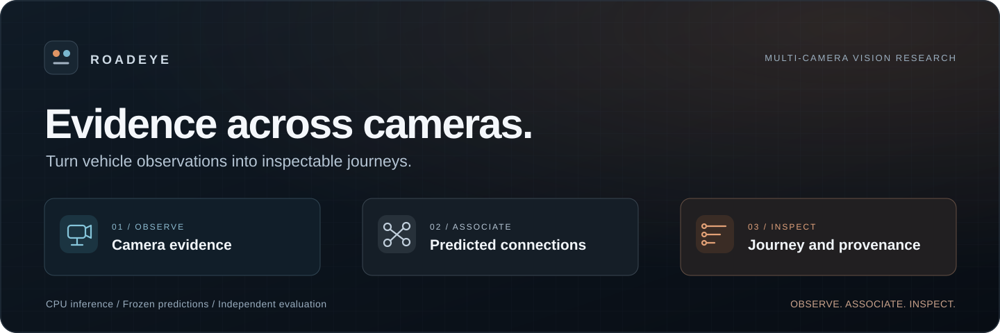
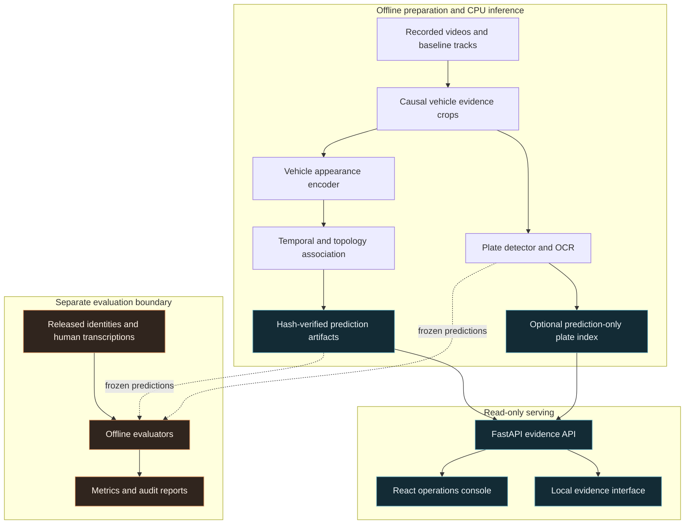
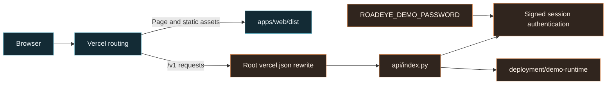

<p align="center">
  
</p>

# RoadEye

### Multi-camera vehicle journeys, ANPR research, and traffic observation analytics

RoadEye connects vehicle observations across cameras and makes each predicted journey inspectable through its source evidence: camera, timestamp, vehicle crop, bounding box, association score, and approximate location.

The repository brings together a **React operations console**, a **FastAPI evidence API**, and a **CPU inference and evaluation pipeline**. It also includes a small Vercel deployment fixture for demonstrating authentication and sample records without distributing private datasets or model weights.

**Project context:** Smart India Hackathon · SIH2026172 · Bharat Electronics Limited problem statement.

[Quick start](#quick-start) · [Architecture](#architecture) · [Vercel deployment](#vercel-deployment) · [Measured results](#measured-results) · [Troubleshooting](#troubleshooting)

> **Project status:** Research demonstrator with a read-only prediction backend. The strongest fully scored, identity-consistent journey covers **two cameras**. The frozen OCR test measured **13.85% exact full-string accuracy**. The six-camera and 90% OCR targets remain unmet. See the [measured results](#measured-results) for denominators and scope.

## What RoadEye does

| Capability | Implementation | Scope |
| --- | --- | --- |
| Cross-camera association | CPU appearance embeddings with temporal, topology, and ambiguity constraints | Predictions over recorded baseline tracklets |
| Evidence inspection | Journey records, vehicle crops, source-frame boxes, timestamps, and file hashes | Source media must exist locally |
| Journey visualization | Camera positions, chronological visits, replay, and interpolated links in the local evidence interface | Approximate geometry; no surveyed road route |
| Plate search | CPU detector/OCR predictions indexed against exact journey evidence | Sparse coverage; predicted strings remain unverified |
| Analytics | Camera visit counts, predicted origin/destination endpoints, and transition support | Aggregates of predictions; no verified congestion or speed measurement |
| Web console | React/TypeScript interface with landing, login, and operations views | The backend implements a read-only subset of the displayed workflows |
| Cloud preview | Vite static build and a Python function on the same Vercel domain | One synthetic vehicle journey across two sample cameras |
| Evaluation | Frozen splits, independent human OCR review, identity matching, and audit reports | Evaluation truth stays outside the runtime data boundary |

The current backend does not implement mutable alerts, watchlists, review decisions, processing jobs, or scenario controls. UI presence alone does not establish backend support. It also does not provide ownership lookup or a production identity-management system.

## Choose a runtime

| Mode | Configuration | Data | Requirements |
| --- | --- | --- | --- |
| Local sample preview | `deployment/demo.json` | Small committed synthetic fixture | Python API dependencies and Node.js |
| Local recorded-evidence demo | `configs/demo.json` | Frozen S02 predictions and private source media | Prepared artifacts, licensed dataset, and CPU dependencies |
| Optional S06 demo | `configs/demo-s06.json` | Frozen S06 predictions | Separate prepared S06 artifacts; identity accuracy is unverified |
| Vercel preview | `api/index.py` loads `deployment/demo.json` | The same synthetic fixture | Repository-root deployment and a configured demo password |

A fresh clone includes the sample fixture, code, configuration, and reports. Real videos, evidence crops, model checkpoints, and full prediction artifacts are intentionally absent.

The cloud fixture does not run detection, OCR, or Re-ID. It has no source video or image crops, and plate search is not enabled. Some compatibility metadata still uses labels such as `recorded_real`; for this fixture, those labels do **not** indicate real captured data. Its scope is defined by [deployment/demo.json](deployment/demo.json).

## Architecture

### Processing and evidence flow



RoadEye assigns its own vehicle identifiers from predicted tracklets. Association uses evidence available at the decision time; later observations do not rewrite earlier decisions. The baseline tracker is an upstream input, whose own training provenance and causality are separate limitations.

The serving layer reads frozen JSON artifacts and validates their hashes. It does not retrain a model, rerun association, or require a database service to start. Source frames are decoded on demand when the local video is available. OCR adds searchable evidence to an existing journey without merging or changing vehicle identities.

Camera positions are calibration-derived reference points. Dashed connections represent straight-line interpolation between observations, not a verified route through the road network. Similarity and OCR scores are uncalibrated values, not probabilities.

### Deployment flow



In local development, Vite proxies `/v1` to the Python server. In Vercel, the root rewrite forwards those requests to the Python function, which restores the original API path. The frontend uses relative URLs and session cookies, so the browser talks to the same origin in both environments.

## Technology stack

| Layer | Technologies |
| --- | --- |
| Web interface | React 19, TypeScript 5.8, Vite 6, TanStack Query |
| API | Python, FastAPI 0.115, Pydantic; Uvicorn for local serving |
| Computer vision | PyTorch, torchvision, OpenCV, Ultralytics YOLO, EasyOCR |
| Vehicle representation | Accepted fine-tuned Re-ID encoder; recorded comparison baselines |
| Runtime storage | Local JSON artifacts, file hashes, evidence crops, and recorded media |
| Evaluation | NumPy, SciPy, deterministic preparation and independent scoring scripts |
| Original evidence interface | HTML/JavaScript and locally bundled Leaflet 1.9.4 |
| Verification | pytest, Ruff, Vitest, TypeScript checks, Playwright tooling |
| Hosting | Vercel static assets and a Python function for the sample preview |

Dependency declarations are in [pyproject.toml](pyproject.toml), [requirements-cpu.txt](requirements-cpu.txt), [requirements-training.txt](requirements-training.txt), and [apps/web/package.json](apps/web/package.json). The lightweight API installation does not install the full computer-vision stack.

## Quick start

This path runs the sample preview from a fresh clone, without CityFlow downloads or model weights. Commands below use Windows PowerShell and start the web interface on **port 5174**.

### 1. Prepare the project

Prerequisites: Git, Node.js **22.15 or newer** with npm, and Python **3.11 or 3.12**. Python 3.11 is the documented local research environment; the package accepts `>=3.11,<3.13`.

```powershell
git clone https://github.com/ashuujha/RoadEye.git
cd RoadEye

py -3.11 -m venv .venv
.\.venv\Scripts\python.exe -m pip install --upgrade pip
.\.venv\Scripts\python.exe -m pip install -e . "uvicorn==0.30.6"

npm.cmd run install:web
```

If using Python 3.12, replace `py -3.11` with `py -3.12`. On macOS/Linux, use `python3.11 -m venv .venv`, `.venv/bin/python`, and `npm` in place of the Windows commands.

### 2. Set the password and start the API

Choose a password with at least **16 characters**. The prompt keeps it out of command history and does not print it:

```powershell
$credential = Read-Host "Choose a RoadEye demo password (16+ characters)" -AsSecureString
$env:ROADEYE_DEMO_PASSWORD = [System.Net.NetworkCredential]::new("", $credential).Password

.\.venv\Scripts\python.exe -m roadeye serve --config deployment/demo.json --host 127.0.0.1 --port 8000
```

Leave this terminal running. The password is a process environment variable; this entrypoint does not automatically read a `.env` file.

For Bash, set it before starting the API:

```bash
read -r -s -p "Choose a RoadEye demo password (16+ characters): " ROADEYE_DEMO_PASSWORD
echo
export ROADEYE_DEMO_PASSWORD
.venv/bin/python -m roadeye serve --config deployment/demo.json --host 127.0.0.1 --port 8000
```

### 3. Start the web interface

Open a second terminal in the repository root:

```powershell
npm.cmd --prefix apps/web run dev -- --host 127.0.0.1 --port 5174 --strictPort
```

Open **http://127.0.0.1:5174**. Choose **Live Dashboard** to reach Operator Access, select **Admin** (`administrator`), and enter the password configured in the API terminal. The API listens on **http://127.0.0.1:8000**; its sample configuration serves a small placeholder at `/`, so use port **5174** for the React interface.

The other accepted demo actors are `investigator`, `approver`, and `viewer`. They use the same configured password. These are demo actor presets, not independently provisioned user accounts or distinct permission policies.

Use `Ctrl+C` in each terminal to stop its server. `--strictPort` makes an occupied port explicit instead of silently choosing a different one.

### 4. Confirm readiness

```powershell
Invoke-RestMethod http://127.0.0.1:8000/v1/health/ready
```

The response should contain:

```json
{
  "data": {
    "status": "ready",
    "mode": "local_prediction_demo",
    "runtime_artifact_integrity": "PASS"
  }
}
```

This verifies service startup and artifact integrity. It does not verify model accuracy, source-video availability, or every console workflow. Before login, `/v1/auth/me` returning `401` is expected.

## Run the recorded-evidence demo

The full local demo requires the private data and prediction artifacts used by its selected configuration. Cloning this repository does not download or reconstruct them.

After the basic installation, install the CPU requirements and build the web interface:

```powershell
.\.venv\Scripts\python.exe -m pip install -r requirements-cpu.txt
npm.cmd run build
```

For the default S02 configuration, restore the licensed dataset under `data/cityflow/` and the matching prepared prediction directory under `artifacts/reid-trained-s02/`. The service expects these six runtime files:

| File | Purpose |
| --- | --- |
| `prepared.json` | Preparation provenance and hashes of supporting artifacts |
| `run.json` | Run metadata and frozen prediction hashes |
| `journeys.json` | Vehicle IDs and chronological camera visits |
| `links.json` | Cross-camera association evidence |
| `tracklets.json` | Local tracks and their crop/frame evidence |
| `topology.json` | Approximate camera reference positions |

The current S02 configuration additionally requires its exact `plate-index.json` and `plate-runtime-manifest.json`. Referenced crop files and original videos must exist at the paths recorded in those artifacts. Keep the evaluator's identity mappings separate from the runtime directory.

With `ROADEYE_DEMO_PASSWORD` set in the API terminal, start the service:

```powershell
.\.venv\Scripts\python.exe -m roadeye serve --config configs/demo.json --host 127.0.0.1 --port 8000
```

This configuration serves the built React interface at **http://127.0.0.1:8000**. For frontend development, keep using the separate Vite server on port 5174. Startup deliberately fails when required artifacts, the frontend build, or integrity checks are missing.

The optional S06 configuration is `configs/demo-s06.json`. It requires its own frozen artifacts and must retain its no-ground-truth disclosure. Consult the [S02 audit](reports/reid-trained-s02-audit.md), [S06 audit](reports/s06-demo-audit.md), and [runtime plate-search audit](reports/plate-search-runtime-audit.md) before preparing or presenting either dataset.

The original [test_frontend](test_frontend/README.md) is also retained for evidence inspection. Historical runbooks describe earlier checkpoints; the current configuration files determine which frontend and dataset are actually served.

## Vercel deployment

Deploy the **repository root** so the static frontend and Python function are both included. The checked-in [vercel.json](vercel.json) defines the intended build settings:

| Setting | Value |
| --- | --- |
| Root Directory | Leave empty: repository root |
| Framework Preset | Vite |
| Install Command | `npm run install:web` |
| Build Command | `npm run build` |
| Output Directory | `apps/web/dist` |
| Python entrypoint | `api/index.py`, exporting `app` |
| Runtime dependency manifest | Root `pyproject.toml`, including `fastapi==0.115.0` |
| Required environment variable | `ROADEYE_DEMO_PASSWORD`, at least 16 characters |

1. Import the GitHub repository into Vercel and select the intended branch.
2. Keep Root Directory empty. `apps/web/vercel.json` is a file, not a valid root directory; `apps/web` alone excludes the root Python API.
3. Ensure project-level build overrides agree with the table above.
4. Add `ROADEYE_DEMO_PASSWORD` to the deployment environments you use, such as Production and Preview. Keep it server-side; do not prefix it with `VITE_`.
5. Deploy and confirm that logs include the npm installation and Vite build, and that the Python function is included.
6. Check `/v1/health/ready`, then test login and authenticated `/v1/auth/me` on the deployed domain.

Vercel supports Python dependency manifests and file-based functions under `/api`. This repository declares FastAPI in `pyproject.toml` and explicitly routes the web client's requests to that function. See the [Python runtime documentation](https://vercel.com/docs/functions/runtimes/python) for the platform contract.

The `/v1/:path*` rewrite forwards to `/api?__roadeye_path=/v1/:path*`; the entrypoint restores the API path before FastAPI routing. `/login` rewrites to the static `index.html`. The native `/api/vehicles` and other local inspection routes are not separately exposed by this deployment configuration.

Changing project environment variables requires a new deployment to use the new values. For root-directory and build behavior, see Vercel's [build configuration documentation](https://vercel.com/docs/builds/configure-a-build).

The deployment bundles synthetic JSON records. It excludes private datasets, full inference artifacts, and heavyweight model dependencies. A successful deployment or ready endpoint does not turn this fixture into a live video-processing backend.

## Configuration and sessions

| Name | Where it is read | Meaning |
| --- | --- | --- |
| `ROADEYE_DEMO_PASSWORD` | Python API environment | Required shared demo password; minimum 16 characters |
| `API_PROXY` | Vite development process | Optional API target; defaults to `http://127.0.0.1:8000` |
| `--config` | Local `roadeye serve` command | Selects runtime artifacts, dataset root, frontend root, and optional plate index |
| `--host`, `--port` | Local `roadeye serve` command | API bind address and port |

Local sessions use opaque tokens backed by an in-memory store. Restarting the local API invalidates them. Vercel uses signed cookies that can be verified across function instances. Sessions expire after eight hours; cookies are `HttpOnly`, `SameSite=Strict`, and `Secure` when the request uses HTTPS.

Vercel logout clears the browser cookie but does not revoke a copied signed token individually. Changing the password invalidates tokens for instances using the new password. This shared-password mechanism is suitable for the demo's limited access model; production accounts, permission enforcement, revocation, and retention controls need a separate implementation.

## API guide

The React client uses the `/v1` compatibility API. JSON success responses generally wrap their payload in `data`. Protected endpoints require the `roadeye_session` cookie returned by login.

| Method | Route | Purpose |
| --- | --- | --- |
| `GET` | `/v1/health/ready` | Public readiness and artifact-integrity status |
| `POST` | `/v1/auth/login` | Authenticate an actor with the configured password |
| `GET` | `/v1/auth/me` | Read the current authenticated actor |
| `POST` | `/v1/auth/logout` | Clear the session cookie |
| `GET` | `/v1/demo/runs` | List the configured frozen run |
| `GET` | `/v1/demo/scenarios` | Describe the available read-only scenario |
| `GET` | `/v1/cameras` | Camera records |
| `GET` | `/v1/graph` | Approximate topology and geometry notices |
| `GET` | `/v1/observations` | Paginated observations; requires `run_id`, `start`, and `end` |
| `GET` | `/v1/observations/{observation_id}` | One observation and its evidence metadata |
| `GET` | `/v1/evidence/{evidence_id}` | Evidence crop, when the file is available |
| `GET` | `/v1/analytics/summary` | Prediction aggregates; requires `run_id`, `start`, and `end` |
| `POST` | `/v1/trajectories` | Look up journeys through the available plate index |

The compatibility adapter serves a frozen snapshot. For example, the observations handler accepts `start` and `end` for client compatibility but does not filter observations by them. Timestamps are mapped onto a fixed display origin, not the current wall clock. A trajectory POST performs a lookup; it does not start inference or persist a new journey.

To check authentication from PowerShell, use another terminal with the same `ROADEYE_DEMO_PASSWORD` set:

```powershell
$baseUrl = "http://127.0.0.1:8000"
$loginBody = @{
    actor = "administrator"
    password = $env:ROADEYE_DEMO_PASSWORD
} | ConvertTo-Json

Invoke-RestMethod -Method Post -Uri "$baseUrl/v1/auth/login" `
    -ContentType "application/json" -Body $loginBody -SessionVariable roadeyeSession

Invoke-RestMethod -Uri "$baseUrl/v1/auth/me" -WebSession $roadeyeSession
Invoke-RestMethod -Uri "$baseUrl/v1/cameras" -WebSession $roadeyeSession
```

The local server also exposes native inspection routes such as `/api/status`, `/api/vehicles`, `/api/analytics`, `/api/plate-search`, and per-vehicle crop/frame endpoints. Read [src/roadeye/demo.py](src/roadeye/demo.py) for their exact parameters. Automatic `/docs`, `/redoc`, and `/openapi.json` routes are disabled on the configured demo app.

## Measured results

These are recorded research results from frozen local slices. They do not measure the synthetic cloud fixture and do not establish city-wide or official benchmark performance.

| Evaluation | Recorded result | Interpretation and evidence |
| --- | --- | --- |
| Trained Re-ID development retrieval | Rank-1 **87/99**, mAP **0.8829**, versus epoch-zero **67/99**, **0.5732** | Model-selection evidence on identity-disjoint S01/S03 development pools; [accepted-model report](reports/reid-trained-model.json) |
| Frozen S02 associations | **1,503** predicted IDs, **35** multi-camera predictions, **37** links | **3/37** links evaluable: three correct, **34 unknown**; [S02 audit](reports/reid-trained-s02-audit.md) |
| Frozen S02 retrieval and recall | Causal rank-1 **10/20**, mAP **0.6170**; pairwise recall **3/23** | Small, partially labeled local evaluation; [S02 metrics](reports/reid-trained-s02-metrics.json) |
| Verified journey span | **2 cameras** fully scored and identity-consistent | S02 predicted maximum is three; the six-camera target remains **FAIL**; [repair audit](reports/reid-six-camera-repair-audit.md) |
| S06 prediction demonstration | **666** predicted IDs, **123** multi-camera IDs, **160** links; maximum **5 cameras** | No released local identity truth; accuracy **UNVERIFIED**; [S06 report](reports/s06-demo-prediction.md) |
| Indian plate-box detector | Precision **52/55 = 94.55%**, recall **52/61 = 85.25%**, F1 **0.8966** | 36 test scenes, confidence/IoU thresholds 0.50; detection boxes only; [detector test](reports/anpr-detector-test.json) |
| Sealed OCR recognition | **27/195 = 13.85%** exact strings; **26.22%** character error rate | 200 reviewed families, five unreadable; 95% accuracy interval **9.69–19.40%**; 90% target **FAIL**; [sealed audit](reports/anpr-sealed-test-audit.md) |
| Runtime plate indexing | S02: **1** searchable entry from **216** crops; S06: **2** from **849** | Engineering integration with sparse, unverified recognition coverage; [runtime audit](reports/plate-search-runtime-audit.md) |

Three correct evaluable links do not imply 100% overall association accuracy when 34 links remain unscored. Plate-box precision is not full-string OCR accuracy. Counting predicted camera visits does not measure traffic density or congestion.

S02, S04, and S05 have already been consumed by the documented evaluation or diagnostic work. Future variants on those scenarios must be described as post-hoc, not fresh held-out evidence. Training and model selection use the designated S01/S03 development protocol; any new accuracy claim needs an appropriate new frozen evaluation.

For timing, integrity checks, provenance limitations, and the complete claim ledger, see the [final integrated audit](reports/final-integrated-audit.md) and [demo presentation](reports/final-demo-presentation.md).

## Verification

Run frontend checks from the repository root:

```powershell
npm.cmd --prefix apps/web run typecheck
npm.cmd run test:web
npm.cmd run build
```

For the small API/authentication suite, install the test client dependencies in the Python environment:

```powershell
.\.venv\Scripts\python.exe -m pip install "pytest==8.3.3" "httpx==0.28.1"
.\.venv\Scripts\python.exe -m pytest -q tests/test_serverless_auth.py tests/test_vercel_api.py
```

With the CPU dependencies installed, the broader research suite and lint command are:

```powershell
.\.venv\Scripts\python.exe -m pytest -q
.\.venv\Scripts\python.exe -m ruff check src tests scripts
```

The tests cover authentication, artifact validation, evidence-path containment, association/evaluation boundaries, OCR review rules, plate-index joins, and analytics. Historical reports record checks against specific source checkpoints; they are not a claim that every check has passed on every later revision or platform.

The existing frontend `generate` script targets `packages/roadeye/openapi.json`, which is absent from this branch. It is not part of the build or verification instructions above.

## Troubleshooting

| Symptom | What to check |
| --- | --- |
| Vercel says the Root Directory is invalid | Keep it empty for this repository. A path ending in `vercel.json` is a configuration file, not a directory. |
| Deployment completes almost immediately but the site returns `404 NOT_FOUND` | Inspect build logs for the npm installation and Vite build; confirm `apps/web/dist/index.html` is produced and the output directory matches. |
| `npm ci` reports a missing lockfile | Confirm `apps/web/package-lock.json` is committed and the install command runs from the repository root through `npm run install:web`. |
| Build reports “No python entrypoint found” | Check that the project uses the repository's Vite preset and root configuration, with `api/index.py` present. |
| Login or readiness returns a Vercel `404` | Check `/v1` routing, the Python function in deployment outputs, and the deployed commit. A working static page does not establish API availability. |
| API returns `500`, logs show `No module named 'fastapi'` | Check the deployed root `pyproject.toml` includes FastAPI and inspect the Python dependency-install logs. Rebuild after correcting the manifest. |
| API returns `503` with a password configuration message | Set `ROADEYE_DEMO_PASSWORD` to 16 or more characters in the correct environment, then restart locally or redeploy. |
| `/v1/auth/me` returns `401` before login | Expected: no valid session has been established. |
| Login returns `401 INVALID_CREDENTIALS` | Use the exact password loaded by the API process or deployment; the repository has no default password. |
| Local login works once, then fails after restart | Local sessions are stored in memory. Sign in again and verify the same hostname is used consistently. |
| Local `/v1` requests fail through Vite | Confirm the API is running on port 8000, or set `API_PROXY` in the Vite terminal before startup. |
| `Frontend build directory is missing` | Run `npm run build` for the recorded-evidence configuration, which points to `apps/web/dist`. |
| Missing runtime files or hash mismatch | Restore the complete matching artifact set for the selected config. Do not bypass integrity checks or mix files from different runs. |
| Evidence image returns `404` in the sample preview | The committed cloud/sample fixture has no source crops or videos. Use prepared local evidence for image inspection. |
| Alerts, reviews, jobs, or scenario controls fail | Those mutable operations are not implemented by the current read-only backend. |
| Plate search is empty | Check the selected configuration and index availability; the sample fixture disables search, and real-data coverage is sparse. |
| `/docs` returns `404` | Interactive API docs are disabled on the normal demo app. Refer to the route implementation and API guide above. |

When reporting a problem, include the deployment commit, requested URL, HTTP status, and first relevant server exception. Remove passwords and session cookies from shared logs.

## Repository map

```text
RoadEye/
├── api/                     # Vercel Python entrypoint
├── apps/web/                # React console, Vite configuration, frontend tests
├── configs/                 # Frozen experiments and local demo configuration
├── deployment/              # Public synthetic fixture and lightweight API config
├── docs/assets/             # README visuals
├── notebooks/               # Private GPU training workflow
├── reports/                 # Measured results, provenance, audits, and runbooks
├── scripts/                 # Dataset inspection, training, inference, evaluation
├── src/roadeye/              # Python implementation
│   ├── auth.py              # Local and serverless demo sessions
│   ├── demo.py              # Artifact-backed evidence API
│   ├── frontend_compat.py   # Read-only /v1 response adapter
│   ├── association.py       # Cross-camera link decisions
│   ├── embeddings.py        # Appearance feature preparation
│   ├── evaluation.py        # Separate identity-scoring boundary
│   ├── anpr.py              # Detector and OCR benchmark tooling
│   ├── runtime_ocr.py       # Prediction-only runtime OCR
│   ├── plate_search.py      # Validated plate-to-evidence index
│   └── analytics.py         # Prediction aggregates
├── test_frontend/           # Original local evidence interface and Leaflet
├── tests/                   # Python tests
├── third_party/             # Retained upstream licenses and notices
├── pyproject.toml           # Python package and lightweight runtime dependency
├── requirements-cpu.txt     # Pinned CPU research environment
├── requirements-training.txt
├── package.json             # Root web install/build/test commands
└── vercel.json              # Root build, function packaging, and routing
```

Local `data/`, `artifacts/`, `.venv/`, and built `dist/` directories are excluded from version control. Review staged paths before committing generated output or dependency folders.

## Further documentation

| Topic | Start here |
| --- | --- |
| Product goals and claim boundaries | [prd.md](prd.md) |
| Design history and technical boundaries | [architecture.md](architecture.md) |
| Engineering phases and milestones | [plan.md](plan.md) |
| Baseline CPU workflow and artifact contract | [Phase 2 runbook](reports/phase2-runbook.md) |
| Private Re-ID training and artifact acceptance | [Training runbook](reports/reid-training-runbook.md) |
| Frozen S02 evaluation | [S02 audit](reports/reid-trained-s02-audit.md) |
| Indian detector/OCR research | [ANPR audit](reports/anpr-audit.md) |
| Sealed OCR score | [Sealed-test audit](reports/anpr-sealed-test-audit.md) |
| Runtime plate search | [Plate-search audit](reports/plate-search-runtime-audit.md) |
| Full integration evidence | [Final audit](reports/final-integrated-audit.md) |
| Presentation with qualified results | [Demo presentation](reports/final-demo-presentation.md) |

## Contributing and future work

Keep changes focused and include a reproducible verification path. Preserve file-hash checks, observation provenance, ground-truth isolation, and the distinction between measured results and predictions. Never turn an OCR suggestion into reviewed truth or reuse a consumed test split as fresh evidence after tuning.

The next research priorities are improved cross-camera appearance discrimination, higher OCR coverage and recognition quality, and independent evaluation on new data. Product work includes aligning every visible console action with implemented APIs and designing production authentication, persistent workflows, and operational controls. These are future work, not current capabilities.

Read [agents.md](agents.md) before agent-assisted changes. Keep licensed datasets, derivative crop bundles, credentials, model weights, review transcriptions, and databases out of commits.

## Attribution and licensing

This repository does not currently include a root project license. Do not assume an MIT, Apache, or other license grant for the project as a whole. Included third-party code retains its own notices: [FastReID license](third_party/fastreid/LICENSE), [FastReID adaptation notice](third_party/fastreid/NOTICE.md), and [Leaflet license](test_frontend/vendor/leaflet/LICENSE).

Dataset and model permissions must be reviewed separately from code permissions. CityFlow-derived data and training bundles remain private. The final audit records incomplete authoritative license evidence for the Indian image archive; the README does not grant redistribution rights for it.
