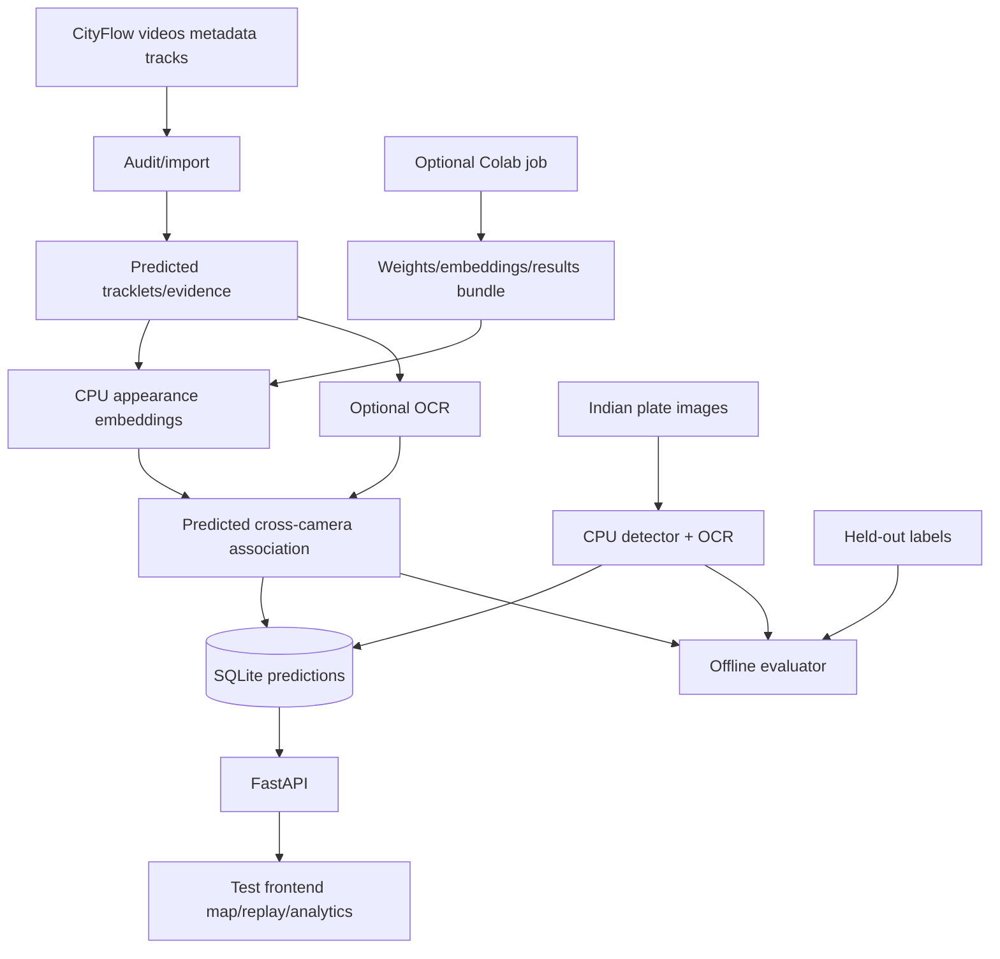

# System architecture

## Stack
Python 3.11, FastAPI/Uvicorn, SQLite, NumPy, OpenCV, PyTorch/torchvision CPU, EasyOCR (`gpu=False`), Ultralytics YOLOv8n, and plain HTML/JavaScript with Leaflet assets. This minimizes DevOps and keeps CV support strong. CityFlow baseline tracks are preferred; a generic ResNet fallback is explicitly labeled if vehicle-specialized weights cannot be exported.

Use synchronized scenario-relative timestamps, GPS camera points, and straight-line inferred links. Appearance similarity is primary; normalized OCR edit similarity is secondary only when both reads are legible. Reject ambiguous links. Analytics count observed visits, not interpolated points or total city traffic. Store provenance, model versions, frame paths, boxes, score types, and run IDs; keep evaluator identities separate.

Future-only architecture sections: Kafka streaming, road-network matching, and authenticated access/retention/misuse governance. None is implemented in this hackathon build.

