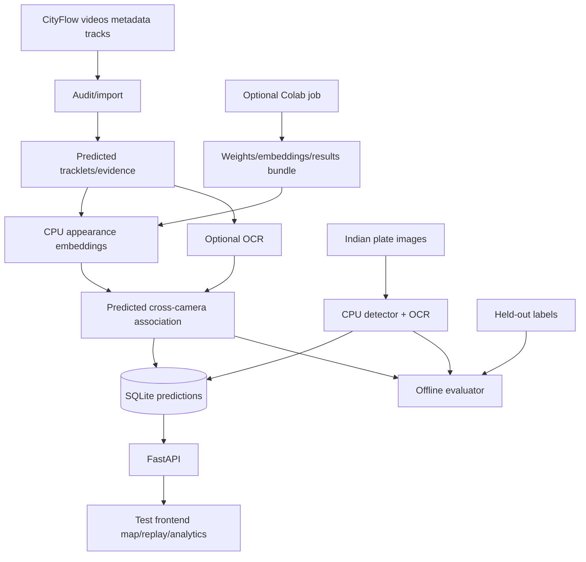

# System architecture

## Stack
Python 3.11, FastAPI/Uvicorn, SQLite, NumPy, OpenCV, PyTorch/torchvision CPU, EasyOCR (`gpu=False`), Ultralytics YOLOv8n, and plain HTML/JavaScript with Leaflet assets. This minimizes DevOps and keeps CV support strong. CityFlow baseline tracks are preferred; a generic ResNet fallback is explicitly labeled if vehicle-specialized weights cannot be exported.

Use synchronized scenario-relative timestamps, GPS camera points, and straight-line inferred links. Appearance similarity is primary; normalized OCR edit similarity is secondary only when both reads are legible. Reject ambiguous links. Analytics count observed visits, not interpolated points or total city traffic. Store provenance, model versions, frame paths, boxes, score types, and run IDs; keep evaluator identities separate.

Future-only architecture sections: Kafka streaming, road-network matching, and authenticated access/retention/misuse governance. None is implemented in this hackathon build.

## Phase 2 foundation repair

The Phase 2 command reads the existing frozen S04 manifest and all its predicted DeepSORT/Mask R-CNN tracklets. No arbitrary tracklet cap is applied. A sequential pass through each video extracts the first three observed crops per local track, with clipped boxes and frame/path/checksum evidence. Tracks without a complete prefix are explicitly reported as excluded.

The implemented appearance fallback is ImageNet-pretrained ResNet-50, not a vehicle-specialized model. CPU features are normalized per crop, averaged over the three-observation prefix, and normalized again. Downloading the official checkpoint is an explicit preparation command; cached inference does not download models or access the network. Features and provenance are stored in ignored local artifacts, not SQLite or the frontend yet.

Association processes observations in scenario-time order. An embedding becomes usable only at its prefix's final observation. Candidate groups contain only already-observed tracklets; later track endpoints and crops cannot rewrite earlier decisions. RoadEye UUIDs are derived from the founding predicted track key, independently of GT. The current conservative policy rejects same-camera fragment merges/revisits. It permits nearby overlapping views, rejects stale and physically implausible transitions, and applies similarity and ambiguity thresholds fixed before this diagnostic run. Rejected decisions and their candidate scores are retained.

There was no pre-existing road/topology configuration. The new conservative proximity graph uses inverse-calibrated ROI reference points. The dataset README explicitly states that exact camera GPS positions are unavailable. These points are approximate road-plane references, not surveyed camera positions or a verified road graph. Distance/time checks are heuristics with documented tolerances, not measured vehicle speeds.

GT access is isolated in `roadeye.evaluation`, run only after immutable prediction artifacts have been written. The evaluator matches predicted and GT boxes one-to-one at each frame using IoU, then checks track coverage and identity purity. Unknown or ambiguous labels are reported as unscored; zero evaluable links produce a null metric. Report direct-link precision with its evaluable denominator, global-ID pairwise precision/recall, causal appearance retrieval, and GT visit coverage separately.

S04 is reserved for evaluation, while S01/S03 are reserved for later development. This run trains on no CityFlow data and does not tune thresholds on S04. Because the S04 window was chosen using GT coverage during feasibility, its measured results are a fixed-subset diagnostic rather than an unbiased held-out or official benchmark. Upstream baseline MTSC training provenance and causality have not been independently audited; RoadEye's own decision causality is tested.

References: [official ResNet-50 weights and transforms](https://docs.pytorch.org/vision/stable/models/generated/torchvision.models.resnet50.html), the local CityFlow `ReadMe.txt`, and [AI City calibration/annotation FAQ](https://www.aicitychallenge.org/2022-faqs/).

## Bounded vehicle Re-ID extension

The optional `fastreid_veri_sbs_r50_ibn` encoder uses the published FastReID VeRi
checkpoint through a CPU-only adapter with existing torch/torchvision. It preserves
IBN, non-local blocks, GeM, BN neck, RGB 256x256 bicubic preprocessing and checkpoint
normalization. Checkpoint and runtime-source hashes are recorded; an explicit
upstream parity script checks the adaptation. Model loading never downloads.
Source, license and modifications are recorded in `third_party/fastreid/NOTICE.md`.

The optional quality prefix accepts the first three sufficiently large, detailed
crops, at least 0.5 seconds apart, within three seconds of the first baseline
observation. Each crop is judged when its own frame arrives. Readiness is the third
accepted sample's timestamp; later clearer crops cannot revise a past descriptor.
Incomplete prefixes remain excluded with reasons. Visit start time remains the
first baseline observation, distinct from first accepted crop and identity readiness.

All comparison runs explicitly declare development or evaluation role. S01 may
select settings; S05 is frozen before scoring. No CityFlow training occurs. S05
shares camera locations with inspected S04, so new-site or proven new-identity
generalization is not claimed. Quality-filter selection uses a recall denominator
including all GT-mappable baseline tracklets, so dropping hard crops does not
automatically improve the selection objective. The existing association topology,
temporal policy, ambiguity rejection, evidence format and independent IDs remain.

S05 inspection also found nonpositive dimensions in two baseline source rows,
one within the frozen window. The selected evaluation configuration explicitly
enables `exclude_nonpositive_and_record`. Import retains source line, frame,
box, timestamp and window membership in the prepared manifest. Raw files remain
unchanged; other malformed/nonfinite data and unexpected hashes still fail.
The default importer policy remains strict for earlier runs.

The S01 selection gate rejected all vehicle-encoder candidates; the frozen S05
run therefore uses the existing ImageNet fallback and original thresholds. Its
two-camera verified maximum leaves appearance discrimination and score calibration
as the binding architecture problem. A future training iteration may use only
S01/S03 training labels in a portable GPU job; labels stay outside runtime and
the resulting CPU-loaded artifact must carry data split, code, weight and metric
provenance. S05 is now consumed and cannot become a fresh test through retuning.

## Training-only Re-ID repair

The portable training boundary reads released identities only from CityFlow
training scenarios S01/S03. A deterministic scenario-stratified split assigns
whole scoped identities to training or development before crops are written.
The actual private bundle has 2,318 crops from 90 training identities and 582
crops from 23 development identities, with no identity overlap. Every identity
retains evidence from at least two cameras. S02, S04, and S05 are excluded by config
and by bundle-builder validation.

The training job initializes the exact-hash official VeRi encoder and optimizes
cross-entropy plus batch-hard triplet loss. Each identity-balanced batch draws
positive examples across cameras. Development evaluation pools observations per
identity/camera, then measures rank-1 and mean average precision against other
cameras. Epoch zero is evaluated before training; model selection uses mAP,
rank-1, then the earlier epoch. Development labels never enter the exported
runtime artifact.

The data bundle is an ignored private derivative of the licensed dataset. The
separate code archive contains no data, weights, or credentials and carries an
internal source-hash manifest. The Colab notebook verifies that manifest,
explicitly downloads the pinned initialization checkpoint, requires CUDA, and
returns weights, history, and a provenance manifest. `load_roadeye_encoder`
requires the returned weight's full SHA-256 and exact payload schema. Demo
embedding remains CPU-only and performs no download. A real unfine-tuned export
already passed exact local CPU reload parity; trained accuracy and trained-artifact
CPU import remain unverified until the private job is run and returned.

Validation scenario S02 remains untouched for one separately approved frozen
evaluation after model selection. S04 and S05 are consumed diagnostics and may
only receive clearly labelled post-hoc comparisons.

## Accepted trained encoder and S02 result

The returned encoder is accepted through a strict three-member ZIP contract,
full data/config/model hashes, recomputed best-epoch selection, and local CPU
inference. Runtime configuration validates a tracked acceptance report, explicit
training/evaluation scenario separation, exact weight hash, and explicitly
accepted provenance limitations. A generic freeze manifest hashes the model,
configuration, S02 window, acceptance report, and all runtime Python sources.
Prediction artifacts are written and replayed deterministically before the
separate evaluator opens GT.

The S02 run uses the first 180 synchronized seconds from cameras c006–c009 and
the existing association policy without trained-model threshold calibration.
It embeds 1,540 of 1,671 baseline tracklets from 4,620 causal prefix crops. The
model yields 37 predicted links and a three-camera predicted maximum, but only
three links are evaluable and the fully scored consistent maximum is two
cameras. Error analysis shows that 19/20 labelled queries have an admissible
positive after pair-level gates, while only three have a positive above the
0.85 similarity threshold. Development-only score calibration is therefore the
highest-impact association repair. Since S02 is now consumed, any later S02
comparison is post-hoc; training/tuning must remain on S01/S03.

## Local evidence API and test frontend

`roadeye.demo` is a read-only adapter over the frozen S02 prediction directory.
At startup it verifies the prepared-manifest hash and the exact journey, link,
tracklet, and topology hashes. Its file allowlist excludes the evaluation directory,
and its routes expose no CityFlow identities. Evidence endpoints accept only a
RoadEye vehicle ID plus validated visit/sample indexes; crop and video paths are
resolved inside their configured roots. A source frame is decoded on demand and
annotated with the already-predicted baseline box.

The plain `test_frontend/` consumes this API. Leaflet 1.9.4 is bundled locally and
uses no tile service, so startup has no network dependency. The map displays
calibration-derived reference points and dashed straight-line segments. The
timeline distinguishes observed visits from interpolation and reports link cosine
similarity, ambiguity margin, temporal gap, and constraint reason as model evidence,
never as calibrated probability or runtime ground-truth verification. The service
does not load an ML model, rerun association, or alter frozen predictions.

The `/api/analytics` route derives camera visit counts, first/last-camera OD
pairs, and directed transition-support proxies from the same hash-verified
journeys. Camera circles scale by observed runtime visit count. The aggregates
contain no evaluator mapping or plate data and are always `UNVERIFIED`: visit
counts are not traffic density, endpoint pairs are not verified OD flow, and
transition frequency/boundary gaps are not congestion or route travel time.

## Plate-search integration boundary

The local service exposes a plate-search contract and prediction-linked frontend
state. The sealed OCR result is recorded, and both S02 and S06 now load an enabled
index plus runtime manifest from their own ignored prediction directory. It does
not read test transcriptions, create synthetic plates, or silently fall back to
model suggestions.

Runtime OCR produces a separate JSON index and manifest inside the selected
prediction directory. Configuration enables them only by relative paths and exact
SHA-256 values. The index is bound to the scenario and current `journeys.json`
hash, plus the OCR selection report, sealed test report, and runtime OCR manifest
hashes. The service also verifies the manifest's source journey hash, entry hash,
entry count, unverified status, and ground-truth/association claim boundaries.
Every predicted plate entry must resolve to an existing RoadEye ID, visit, sample,
tracklet, camera, observation time, and crop hash. Exact-key validation excludes
owner fields and evaluator identities. Search normalizes uppercase alphanumerics,
ranks exact before prefix before contains matches, and labels both OCR score and
plate text as uncalibrated runtime predictions rather than probabilities or truth.

Indian benchmark strings remain isolated evaluation truth. They measure the
frozen recognizer but are never copied onto CityFlow journeys. The runtime builder
processes all stored evidence samples for multi-camera journeys with the frozen
detector threshold and OCR variant on CPU under a network block. It records source,
model, code, crop-set, exclusion, failure, output, and timing evidence. Search
selection opens the indexed visit/sample and adds the OCR prediction alongside
the existing appearance evidence; OCR never merges, reranks, or changes a RoadEye
identity.

## Development-calibrated association diagnostic

The trained encoder's association score was calibrated only on the 19 S01
identities assigned to the identity-disjoint development split. The sweep leaves
all other predicted tracklets in the candidate pool as distractors and scores
only links that touch a development identity. It requires at least five evaluable
links and 0.80 direct-link precision before a candidate is eligible. Source,
configuration, model, and development-report hashes are frozen before post-hoc
execution.

The selected cosine threshold is 0.65 with a 0.10 ambiguity margin and 45-second
maximum gap. The S05 runtime still receives only observations, approximate
topology, embeddings, and the frozen policy. Its evaluator opens labels only
after predictions are written. Independent replay blocks GT and network access,
checks every crop hash and link evidence cutoff, and reproduces prediction hashes.

The post-hoc S05 result confirms an architecture limit rather than the demo goal:
the maximum predicted group spans five cameras, the maximum fully scored
consistent group spans two, and seven mixed-identity groups exist. Pair-level
analysis shows most labeled positives survive topology but few exceed the
appearance threshold. Further work should improve camera-domain robustness and
descriptor separation using a new development protocol; it must not tune on the
consumed S02/S04/S05 scenarios.

The final repair adds S03's full six-camera metadata-selected window to S01
development calibration and evaluates an optional HSV histogram over the same
causal, hash-bound prefix crops. Weighted concatenation makes the association
cosine exactly decomposable into Re-ID and color components. The selected color
weight is zero, so the frozen post-hoc result uses only the trained Re-ID signal.
Its 0.675 similarity threshold, zero margin, and 45-second gap were frozen before
new S04/S05 predictions. The diagnostic increases raw spans to 16 and eight but
also creates 20 and 26 mixed groups; fully scored consistent span remains two in
both. This confirms a camera-domain descriptor problem, not a basis for relaxing
identity-consistency checks.

## Indian detector and OCR evaluation boundary

The Indian archive is treated as two related inputs: 181 JPEG scene images for
plate detection and 1,840 labeled PNG plate crops for recognition. Exact decoded
pixel duplicates are assigned to one family before any split. Scene images also
use a conservative 64-bit DCT perceptual-hash connected component at Hamming
distance four. Only family representatives enter training or evaluation.

The detector uses a local YOLOv8n checkpoint, 105 scene training representatives,
36 development representatives for the confidence threshold, and 36 sealed test
representatives. EasyOCR runs recognition-only on supplied plate crops using
three fixed CPU preprocessing variants. Models are prepared explicitly and
hashed; demo/runtime construction sets downloads off.

The transcription boundary is sequential. A self-contained page first exposes
only 50 development families. Test rows must remain unreviewed while one
preprocessing variant is selected and all source/model/input hashes are frozen.
Only then can the page expose 200 test families for one scoring run. The only
terminal `review_status` values are `reviewed`, `corrected`, and `unreadable`.
Only hash-bound `reviewed` and `corrected` rows are ground truth. Before sealed
scoring, RoadEye persists and prints exact counts for all three states plus
missing and unrecognized states; either invalid category aborts scoring, and at
least 150 readable rows are required. Blank or model-suggested rows never enter
an accuracy denominator. This produces a recognition-on-crops metric and does
not conflate detector performance with full-string OCR.

The sealed-test review queue is a separate, ground-truth-blind helper. It checks
the frozen OCR-selection hashes and complete prediction grid, reads only
transcription provenance/status fields, and ranks unfinished rows by the frozen
model's uncalibrated score. Detailed suggestions and identifiers stay under
ignored `artifacts/anpr/`; only aggregate counts and claim boundaries may enter
tracked audit material. Triage never supplies truth or changes which rows count.

## Additive OpenStreetMap trajectory view

The authenticated React console includes a standalone Leaflet map workspace.
Two new read-only endpoints expose map-specific shapes without altering the
existing camera, graph, observation, or plate-trajectory contracts:

- `GET /v1/map/cameras?run_id=...` returns camera identifiers, representative
  latitude/longitude, coordinate provenance, and tile attribution metadata.
- `GET /v1/map/trajectories?run_id=...` returns frozen RoadEye vehicle IDs,
  optional predicted plate text, and timestamp-ordered camera points. Optional
  `vehicle_id`, `multi_camera_only`, and `limit` query parameters bound selection.

Both endpoints reuse the existing session dependency and read the already
hash-verified runtime repository. They do not open identity ground truth, perform
inference, change association, or persist state. The browser requests them through
the existing `/v1` Vercel rewrite.

Leaflet 1.9.4 was selected over MapLibre GL JS. Leaflet's raster tile and polyline
model is sufficient for the current tens to low hundreds of trajectories, supports
camera markers and later heatmap plugins, and avoids a vector-style service and API
key. MapLibre is the stronger option for GPU-rendered vector layers at city scale,
but it adds bundle and style-hosting complexity without improving this bounded demo.

The tile source is OpenStreetMap Standard at
`https://tile.openstreetmap.org/{z}/{x}/{y}.png`. It requires no API key, so a
MapTiler or Stadia free-tier quota cannot interrupt the hackathon login flow. The
map keeps the required visible `© OpenStreetMap contributors` attribution linking
to the OSM copyright page. OSM map data is licensed under ODbL; the community tile
service is best-effort, has no SLA, requires normal browser caching and a valid
Referer, and forbids bulk download or offline prefetch. Tile failures leave the
camera and trajectory overlay usable, with a visible warning.

This public OSM endpoint is appropriate only for light interactive demonstration.
A deployment serving sustained public traffic or real Indian ANPR camera feeds
must use a provider with an appropriate service agreement or self-host OSM-derived
tiles, while preserving OSM attribution and the applicable provider terms.
MapTiler and Stadia remain valid hosted alternatives but require account/key and
quota management; no such paid or locked-in dependency is introduced here.

CityFlow V2 camera locations in this project are not surveyed GPS points. The API
uses the existing inverse-calibration representative road references and labels
all payloads `APPROXIMATE_NOT_SURVEYED_GPS`. Polylines join observations in
ascending `identified_at_s` order. Static mode displays the complete predicted
path; replay mode interpolates a marker over the recorded time ordering. Animated
dashes communicate direction, not vehicle speed or a verified road-network route.
