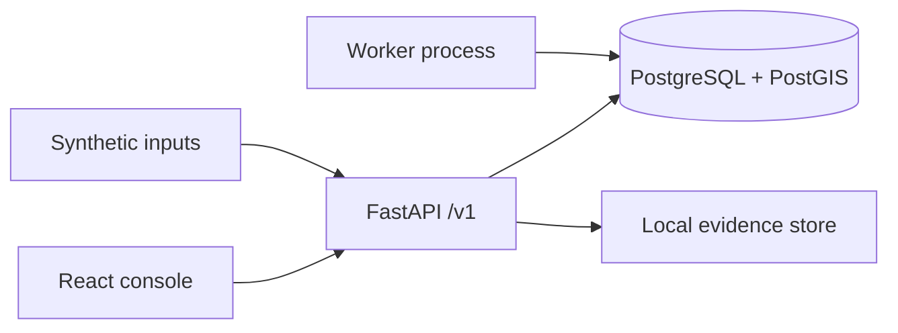
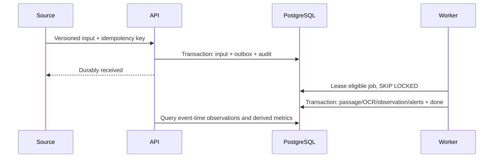

# RoadEye architecture — SIH2026172

A modular monolith exposes FastAPI and a separate worker sharing `packages/roadeye`. PostgreSQL is the sole state authority. The browser polls durable state. Evidence bytes live outside relational rows. Domain modules separate contracts, plates, trajectories, analytics, jobs and application services without a repository class for every table.

Inputs belong to immutable runs/dataset manifests. Runs belong to a fictional network. Cameras belong to zones; lanes belong to cameras; directed edges connect cameras. Inputs reference runs; passages reference input/run/camera/lane; readings and candidates preserve contributions; observations preserve machine decisions; review revisions overlay those decisions. Evidence metadata references immutable objects. Query snapshots carry run versions. Watchlists and approvals are scoped; alerts link supporting observations and evidence. Actions and sensitive reads create audit rows. Sessions store token digests.

Jobs have unique event IDs, available time, attempts, lease token/deadline, error and pending/leased/done/poison states. Expired leases are reclaimable. Domain effects and job completion commit together. Backoff is bounded; exhausted jobs remain inspectable. Delivery is at least once. Input idempotency compares canonical payload digests; business uniqueness constraints prevent duplicate effects. Run-row locking serializes derived version increments and processing within each run.

Graph reconstruction hard-rejects disconnected, reversed and implausibly fast/slow links before scoring. Multiple plausible links and road paths remain visible. Camera sightings are observed; roads between them are inferred. No physical identity is guaranteed by identical text. Traffic counts use passages independently of plate acceptance. Aggregates use half-open UTC capture windows. Late data increments the run version; query snapshots remain immutable and new queries recompute.

Evidence storage validates relative object keys and digests; protected retrieval returns honest missing-object errors. Backup includes database and object directory at a consistent checkpoint. S3 migration replaces the store interface using the same digest/object metadata, with private objects and authenticated delivery. Orphan cleanup must compare keys to metadata after a grace period; it is never an indiscriminate directory deletion.

Local authentication is explicitly enabled by configuration, uses server-side expiring sessions and role checks, and must be replaced by production identity. Local login secrets are environment configuration, never browser constants. Cookie writes require a same-origin/custom-header boundary. Synthetic runs do not become live on replay. Real modes fail at startup until adapters exist. Model confidence is a heuristic input, not calibrated accuracy. PostGIS is installed for the future, but fictional schematic coordinates are not geographic coordinates.
