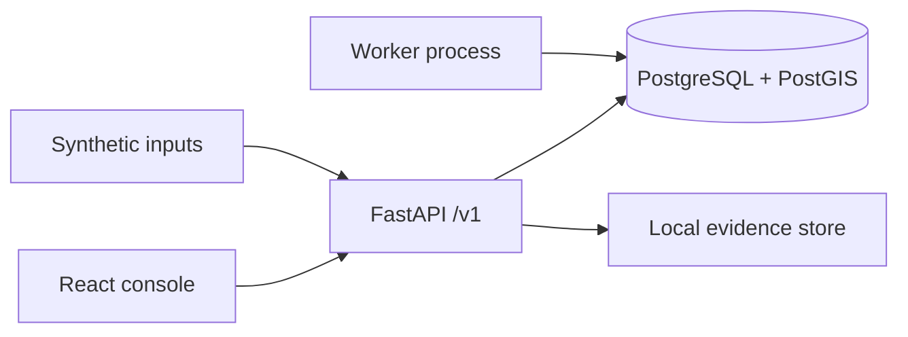
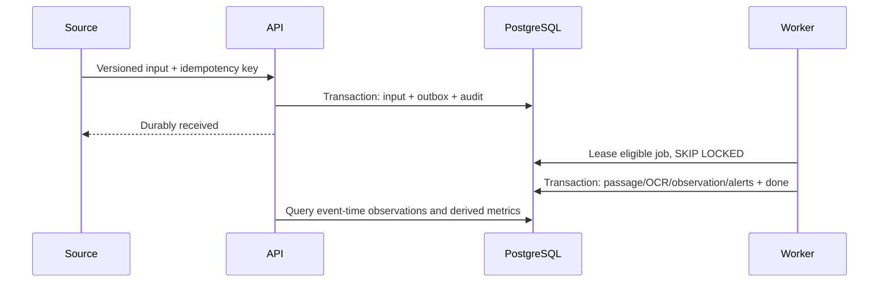
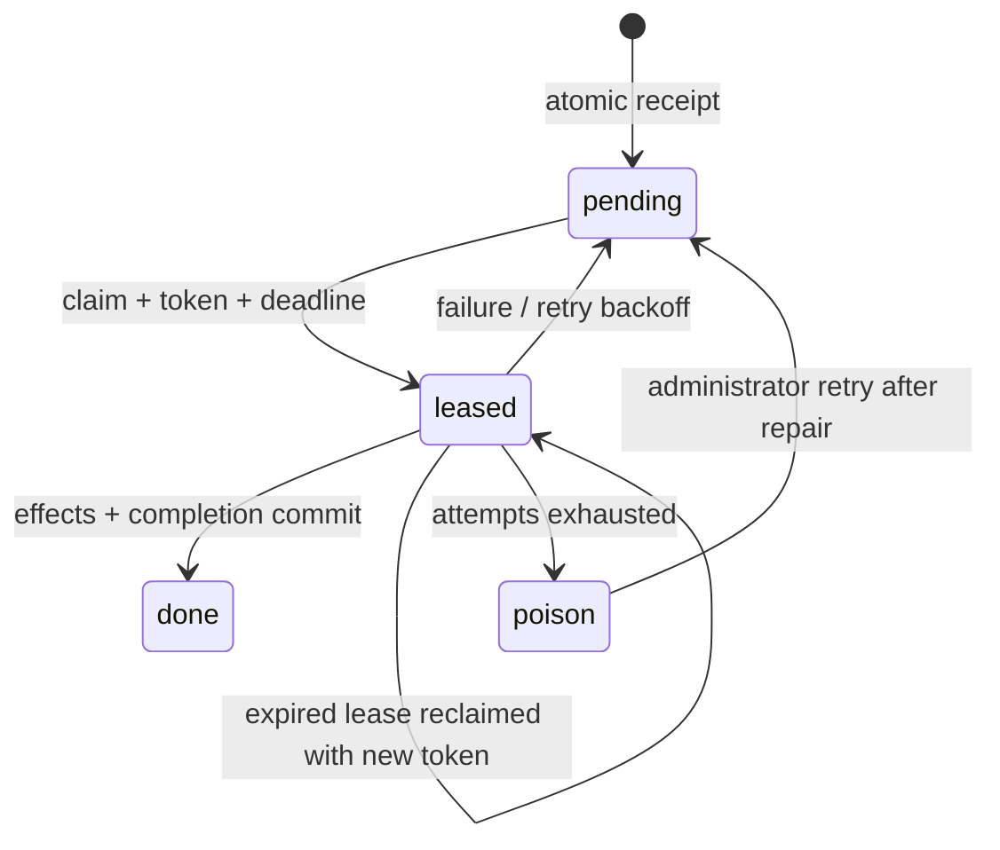
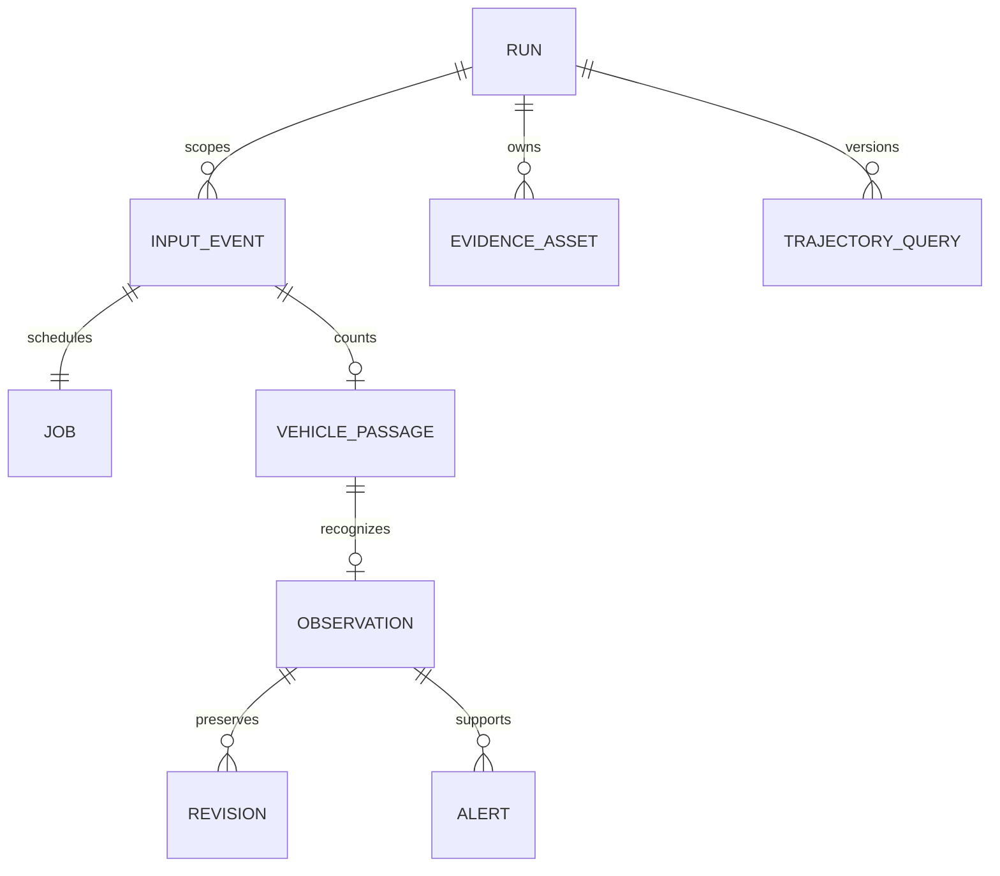
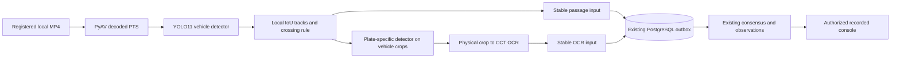

# RoadEye architecture — SIH2026172

A modular monolith exposes FastAPI and a separate worker sharing `packages/roadeye`. PostgreSQL is the sole state authority. The browser polls durable state. Evidence bytes live outside relational rows. Domain modules separate contracts, plates, trajectories, analytics, jobs and application services without a repository class for every table.

Inputs belong to immutable runs/dataset manifests. Synthetic runs belong to a fictional network; recorded runs belong to one uncalibrated camera. Synthetic cameras belong to zones; lanes belong to cameras; directed edges connect cameras. Inputs reference runs; passages reference input/run/camera/lane; readings and candidates preserve contributions; observations preserve machine decisions; review revisions overlay those decisions. Evidence metadata references immutable objects. Query snapshots carry run versions. Watchlists and approvals are scoped; alerts link supporting observations and evidence. Actions and sensitive reads create audit rows. Sessions store token digests.

Jobs have unique event IDs, available time, attempts, lease token/deadline, error and pending/leased/done/poison states. Expired leases are reclaimable. Domain effects and job completion commit together. Backoff is bounded; exhausted jobs remain inspectable. Delivery is at least once. Input idempotency compares canonical payload digests; business uniqueness constraints prevent duplicate effects. Run-row locking serializes derived version increments and processing within each run.

Graph reconstruction hard-rejects disconnected, reversed and implausibly fast/slow links before scoring. Multiple plausible links and road paths remain visible. Camera sightings are observed; roads between them are inferred. No physical identity is guaranteed by identical text. Traffic counts use passages independently of plate acceptance. Aggregates use half-open UTC capture windows. Late data increments the run version; query snapshots remain immutable and new queries recompute.

Evidence storage validates relative object keys and digests; protected retrieval returns honest missing-object errors. Backup includes database and object directory at a consistent checkpoint. S3 migration replaces the store interface using the same digest/object metadata, with private objects and authenticated delivery. Orphan cleanup must compare keys to metadata after a grace period; it is never an indiscriminate directory deletion.

Local authentication is explicitly enabled by configuration, uses server-side expiring sessions and role checks, and must be replaced by production identity. Local login secrets are environment configuration, never browser constants. Cookie writes require a same-origin/custom-header boundary. Synthetic runs do not become live on replay. The default source mode remains synthetic. Registered recorded inference requires an explicit capability flag; unsupported live mode fails configuration validation. Model confidence is a heuristic input, not calibrated accuracy. PostGIS is installed for the future, but fictional schematic coordinates are not geographic coordinates.

## Implemented refinements

Durable receipt now records evidence digest/size/type/key in the same transaction as input and outbox insertion. Keys cannot silently change content within a run. Database triggers protect input/machine rows, audit history and run graph/provenance from updates. Core API payloads have typed response schemas; extensible inspection metadata remains JSON. Readiness requires the current migration head and a working PostGIS function.

Heartbeat freshness uses the run clock; window coverage unions the 120-second validity intervals from processed heartbeat inputs. This is a declared coverage proxy, not physical uptime. Query execution locks the run during snapshot construction to keep versions/results consistent with processing and review transactions.

Container builds use a pinned uv binary with `uv sync --frozen --no-dev`, following the [official uv Docker integration](https://docs.astral.sh/uv/guides/integration/docker/) and [lock/sync behavior](https://docs.astral.sh/uv/concepts/projects/sync/). The uv pin matches the locally exercised 0.12.1 lockfile tooling. Docker execution remains a separate unverified runtime check in this environment.

## Recorded-video extension

The optional `recorded_enabled` capability adds a server-controlled recording registry and a `video_tasks` row owned by an existing outbox job. REAL_C1 has null zone and coordinates; its run graph is empty. Synthetic camera/health/analytics queries remain limited to their six cameras. Recorded requests commit the source manifest, model hashes, processing policy, assigned replay anchor and immutable configuration. Browser-supplied filesystem paths are rejected.

The video worker publishes immutable passage/OCR inputs using the existing ingestion service. Input and outbox insertion remain atomic. Progress commits renew a token-fenced lease; retries deterministically decode from the beginning and reproduce stable event identities. This favors simplicity over seek/checkpoint optimization for a five-minute clip. Interruption cannot acknowledge unfinished inference. Completed video decoding can still have pending consensus jobs; the API reports completion only after every run job is done. Poison jobs report failure and an administrator can retry the selected run.

Crossing frames are unannotated JPEG re-encodings; current runs retain physical plate crops as lossless PNG. Metadata stores digest, size, media type and original-pixel coordinates. Older first-check JPEG crops remain readable and replayable using the encoding snapshotted in their configuration. The immutable MP4 is the original source of decoded pixels. All recorded assets live under the configured recorded evidence root and require investigator authorization. Source mode is `recorded_real`, inference origin `model_inference`; camera-local track IDs do not imply city-wide identity. Recorded trajectory and calibrated analytics requests fail explicitly. See the [recorded runbook](docs/recorded_video_demo.md).
