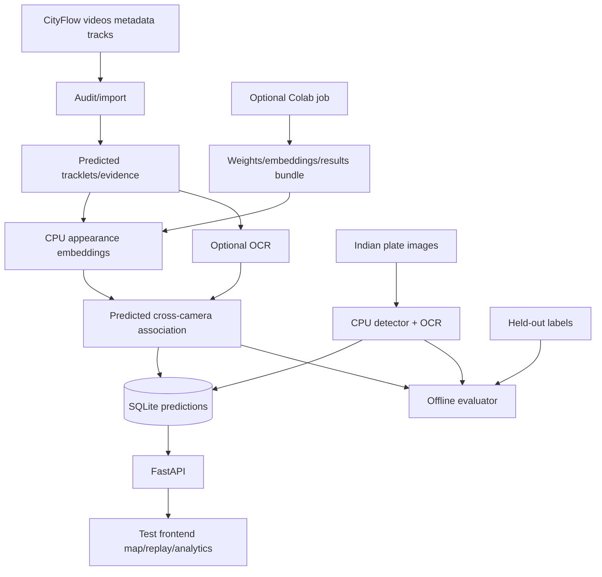

# System architecture

## Stack
Python 3.11, FastAPI/Uvicorn, SQLite, NumPy, OpenCV, PyTorch/torchvision CPU, EasyOCR (`gpu=False`), Ultralytics YOLOv8n, and plain HTML/JavaScript with Leaflet assets. This minimizes DevOps and keeps CV support strong. CityFlow baseline tracks are preferred; a generic ResNet fallback is explicitly labeled if vehicle-specialized weights cannot be exported.

Use synchronized scenario-relative timestamps, GPS camera points, and straight-line inferred links. Appearance similarity is primary; normalized OCR edit similarity is secondary only when both reads are legible. Reject ambiguous links. Analytics count observed visits, not interpolated points or total city traffic. Store provenance, model versions, frame paths, boxes, score types, and run IDs; keep evaluator identities separate.

Future-only architecture sections: Kafka streaming, road-network matching, and authenticated access/retention/misuse governance. None is implemented in this hackathon build.

## Phase 2 foundation repair

The Phase 2 command reads the existing frozen S04 manifest and all its predicted DeepSORT/Mask R-CNN tracklets. No arbitrary tracklet cap is applied. A sequential pass through each video extracts the first three observed crops per local track, with clipped boxes and frame/path/checksum evidence. Tracks without a complete prefix are explicitly reported as excluded.

The implemented appearance fallback is ImageNet-pretrained ResNet-50, not a vehicle-specialized model. CPU features are normalized per crop, averaged over the three-observation prefix, and normalized again. Downloading the official checkpoint is an explicit preparation command; cached inference does not download models or access the network. Features and provenance are stored in ignored local artifacts, not SQLite or the frontend yet.

Association processes observations in scenario-time order. An embedding becomes usable only at its prefix's final observation. Candidate groups contain only already-observed tracklets; later track endpoints and crops cannot rewrite earlier decisions. RoadEye UUIDs are derived from the founding predicted track key, independently of GT. The current conservative policy rejects same-camera fragment merges/revisits. It permits nearby overlapping views, rejects stale and physically implausible transitions, and applies similarity and ambiguity thresholds fixed before this diagnostic run. Rejected decisions and their candidate scores are retained.

There was no pre-existing road/topology configuration. The new conservative proximity graph uses inverse-calibrated ROI reference points. The dataset README explicitly states that exact camera GPS positions are unavailable. These points are approximate road-plane references, not surveyed camera positions or a verified road graph. Distance/time checks are heuristics with documented tolerances, not measured vehicle speeds.

GT access is isolated in `roadeye.evaluation`, run only after immutable prediction artifacts have been written. The evaluator matches predicted and GT boxes one-to-one at each frame using IoU, then checks track coverage and identity purity. Unknown or ambiguous labels are reported as unscored; zero evaluable links produce a null metric. Report direct-link precision with its evaluable denominator, global-ID pairwise precision/recall, causal appearance retrieval, and GT visit coverage separately.

S04 is reserved for evaluation, while S01/S03 are reserved for later development. This run trains on no CityFlow data and does not tune thresholds on S04. Because the S04 window was chosen using GT coverage during feasibility, its measured results are a fixed-subset diagnostic rather than an unbiased held-out or official benchmark. Upstream baseline MTSC training provenance and causality have not been independently audited; RoadEye's own decision causality is tested.

References: [official ResNet-50 weights and transforms](https://docs.pytorch.org/vision/stable/models/generated/torchvision.models.resnet50.html), the local CityFlow `ReadMe.txt`, and [AI City calibration/annotation FAQ](https://www.aicitychallenge.org/2022-faqs/).
