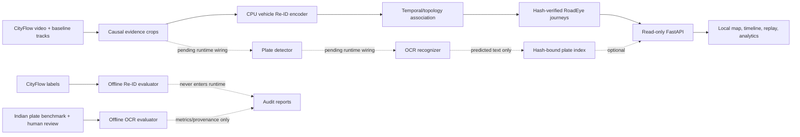

# RoadEye final demo/presentation draft

- Draft date: 2026-09-09
- Intended duration: 7-9 minutes plus questions
- Default live runtime: frozen S02 via `configs/demo.json`
- Optional scale illustration: S06 via `configs/demo-s06.json`
- Claim rule: `PASS`, `FAIL`, and `UNVERIFIED` labels stay visible on slides and in the UI

## Slide 1 - RoadEye: evidence-first vehicle journey reconstruction

**On slide**

RoadEye links vehicle observations across isolated cameras and presents the
predicted journey as inspectable evidence: crop, source frame, time, camera,
association score, approximate location, and replay.

CPU-only local demo. No ownership lookup. No facial identification. No production
surveillance claim.

**Speaker note**

The demonstrator is deliberately narrower than a production ANPR system. Its
value is the crop-to-journey inspection flow and its explicit separation of model
predictions from evaluation truth.

## Slide 2 - Pipeline architecture

**Speaker note**

Ground truth has no path into the demo. The plate-search contract accepts only OCR
predictions attached to existing journey evidence; Indian benchmark strings remain
inside the evaluator. All runtime artifacts are local and hash checked.

## Slide 3 - What is implemented

**PASS - engineering delivery**

- Causal CPU crop extraction, trained vehicle Re-ID loading, association, and
  independent RoadEye IDs.
- Read-only evidence API and local frontend with crop selection, boxed source
  frames, approximate camera map, chronological timeline, and replay.
- Prediction-only camera activity, endpoint, and transition-support analytics.
- Indian plate detector evaluation and a sealed, human-review-gated OCR protocol.
- Plate-search API/index validation and frontend controls, currently blocked until
  sealed OCR scoring and runtime OCR indexing.

**Speaker note**

Implementation completion is not the same as accuracy success. The next slides
state exactly what has and has not been verified.

## Slide 4 - Re-ID result: the honest verified claim

**Verified claim: maximum fully scored, identity-consistent journey = 2 cameras.**

Frozen S02 result:

- 1,503 predicted RoadEye IDs and 37 predicted cross-camera links.
- 3/37 links were evaluable under the partial released mapping; all 3 were correct.
- 34/37 links were unscored and remain unknown, not presumed correct.
- Pairwise recall: 3/23 (13.04%).
- Appearance retrieval: rank-1 10/20 (50.0%), mAP 0.6170.
- Maximum predicted span: 3 cameras.
- Maximum fully scored consistent span: **2 cameras**.

**Speaker note**

Do not summarize this as “100% association accuracy.” The 3/3 value has only 8.1%
link-evaluation coverage. The defensible journey statement is the two-camera
fully scored maximum.

## Slide 5 - S06 demo: reach without a truth claim

**UNVERIFIED - S06 has no released local ground truth.**

- Six-camera input window: c041-c046, 0.0-199.9 seconds.
- 1,674 baseline tracklets; 826 embedded; 848 excluded.
- 666 predicted IDs; 123 predicted multi-camera IDs; 160 predicted links.
- Maximum predicted span: **5 cameras** across two predicted IDs.
- Accuracy, identity consistency, precision, and recall: **UNVERIFIED**.

**Required banner**

> S06 - unverified prediction, no ground truth available

**Speaker note**

S06 is useful for demonstrating interface scale and evidence inspection. It does
not upgrade the verified two-camera result and it does not satisfy a verified
six-camera criterion.

## Slide 6 - Indian plate detector

**PASS - one frozen 36-image scene test, plate boxes only**

| Measure | Result |
|---|---:|
| Ground-truth boxes | 61 |
| True positives / false positives / false negatives | 52 / 3 / 9 |
| Precision | 52/55 = 0.9455 |
| Precision Wilson 95% interval | 0.8515-0.9813 |
| Recall | 52/61 = 0.8525 |
| Recall Wilson 95% interval | 0.7428-0.9204 |
| F1 | 0.8966 |
| Thresholds | confidence 0.50; IoU 0.50 |
| Recorded CPU latency | mean/p95 98.46 ms per image |

**Speaker note**

These are detector bounding-box metrics, not OCR accuracy and not end-to-end ANPR.
The latency is a small local observation and may vary with machine load.

## Slide 7 - OCR result placeholder

**UNVERIFIED until the sealed test command succeeds.**

Replace this block only from the final `anpr-ocr-test` report:

| Measure | Sealed result |
|---|---:|
| Terminal review rows | `[PENDING: must be 200/200]` |
| Readable rows | `[PENDING: must be >=150]` |
| Unreadable rows | `[PENDING]` |
| Exact full-string matches | `[PENDING numerator/denominator]` |
| Full-string accuracy | `[PENDING]` |
| Wilson 95% interval | `[PENDING]` |
| Character error rate | `[PENDING]` |
| CPU mean / p95 latency | `[PENDING]` |
| 90% target | `[PENDING PASS or FAIL from measured accuracy]` |

Development-only context, not the final claim: frozen `color_upscale` achieved
10/48 exact strings (20.83%; Wilson 95% 11.73-34.26%) and 0.2309 CER on 48
readable development families.

**Speaker note**

Never replace the placeholder from model suggestions or partial review. Every one
of the 200 rows must have a terminal human status and at least 150 must be readable.

## Slide 8 - Plate search and evidence fusion

**Current state: scaffold PASS; live OCR results UNVERIFIED.**

- `/api/plate-search/status` exposes readiness and claim boundaries.
- `/api/plate-search` returns zero results while sealed OCR/runtime indexing is
  unavailable.
- A future enabled index must be SHA-256 pinned to the current journey prediction,
  OCR selection report, sealed test report, and runtime OCR manifest.
- Every result must resolve to an existing RoadEye ID, visit, crop, source time,
  tracklet, and camera.
- Exact, prefix, and contains matching is supported over normalized predicted text.
- OCR score is uncalibrated; plate text is a prediction; no owner record exists.

**Speaker note**

After scoring, the remaining work is to run the frozen detector/OCR on runtime
CityFlow evidence, create the validated index, and enable its exact hash in the
chosen demo config. Benchmark transcriptions are never copied into that index.

## Slide 9 - Analytics framing

**UNVERIFIED operational interpretation**

The S06 prediction artifact contains:

- 826 observed runtime visits across 666 predicted IDs.
- 123 predicted multi-camera IDs and 160 predicted transitions.
- Largest camera visit count: c043 with 193 predicted visits.
- Most frequent predicted endpoint pair: c042 to c043 with 21 predicted IDs.
- Highest transition support: c042 to c043 with 35 predicted links.

Use these phrases:

- “observed runtime visit count,” not traffic density;
- “predicted journey endpoints,” not verified OD flow;
- “transition-support proxy,” not congestion;
- “observed boundary gap,” not route travel time.

**Speaker note**

The aggregates inherit association errors. They demonstrate a usable analytics
interface over prediction data, not a city traffic measurement.

## Slide 10 - Live demo sequence

1. Start the default frozen S02 service and point out the runtime integrity status.
2. Search a RoadEye ID, tracklet, or camera; select a real crop.
3. Open the journey timeline, source-frame box, approximate camera positions, and
   uncalibrated incoming-link evidence.
4. Replay the chronological visits; call dashed lines inferred geometry.
5. Show the analytics panel and its `UNVERIFIED` framing.
6. Show plate search:
   - before OCR integration: visibly blocked, zero results, explicit reason;
   - after integration: query one real runtime prediction and open its linked journey.
7. Optionally restart with S06, keep the yellow no-ground-truth banner visible,
   and open one five-camera prediction as an unverified scale illustration.

## Slide 11 - Claim ledger and close

| Statement | Final label |
|---|---|
| CPU/local evidence pipeline works on frozen artifacts | **PASS** after final rehearsal |
| Maximum fully scored consistent journey is two cameras | **PASS - measured local evidence** |
| S06 predicts a five-camera journey | **PASS - deterministic prediction fact** |
| S06 five-camera journey is the same vehicle | **UNVERIFIED** |
| Verified six-camera journey | **FAIL** |
| Detector box precision/recall/F1 above | **PASS - measured frozen test** |
| Sealed OCR accuracy | **UNVERIFIED until placeholder is replaced** |
| 90% OCR target | **UNVERIFIED; later PASS/FAIL from sealed result** |
| Analytics measure traffic, OD flow, or congestion | **UNVERIFIED and not claimed** |
| Plate/vehicle ownership lookup | **Out of scope and not implemented** |

**Closing line**

RoadEye’s demonstrated strength is inspectable, provenance-bound cross-camera
evidence on a CPU-local stack. Its current accuracy boundary is equally clear:
two cameras verified, five cameras predicted without S06 truth, and sealed OCR
still awaiting human-reviewed evaluation.
